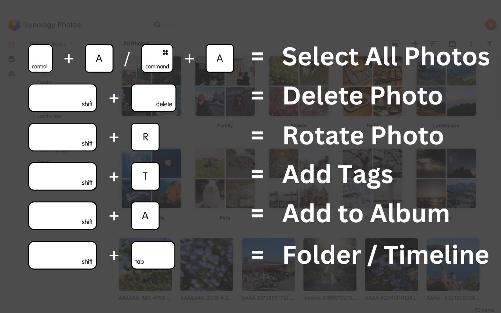

Since 2021, Synology Photos users requested keyboard shortcuts:
- https://community.synology.com/enu/forum/1/post/145837
- https://community.synology.com/enu/forum/1/post/157854
- https://community.synology.com/enu/forum/20/post/139278
- https://community.synology.com/enu/forum/1/post/157627

Synology didn’t add them. This extension does.

- `Cmd + A` (Mac) / `Ctrl + A` (Windows): Select all
- `Shift + Delete` / `Shift + Backspace`: Delete photo (with confirmation)
- `Shift + R`: Rotate clockwise
- `Shift + D`: Download (original, not compressed)
- `Shift + T`: Add tags
- `Shift + A`: Add to album
- `Shift + Tab`: Switch folder / timeline view
- (NEW) `1` - `5`: Rate photo (1-5 stars)

If any shortcut stops working, just create an issue on GitHub and I’ll fix it as soon as I can.
